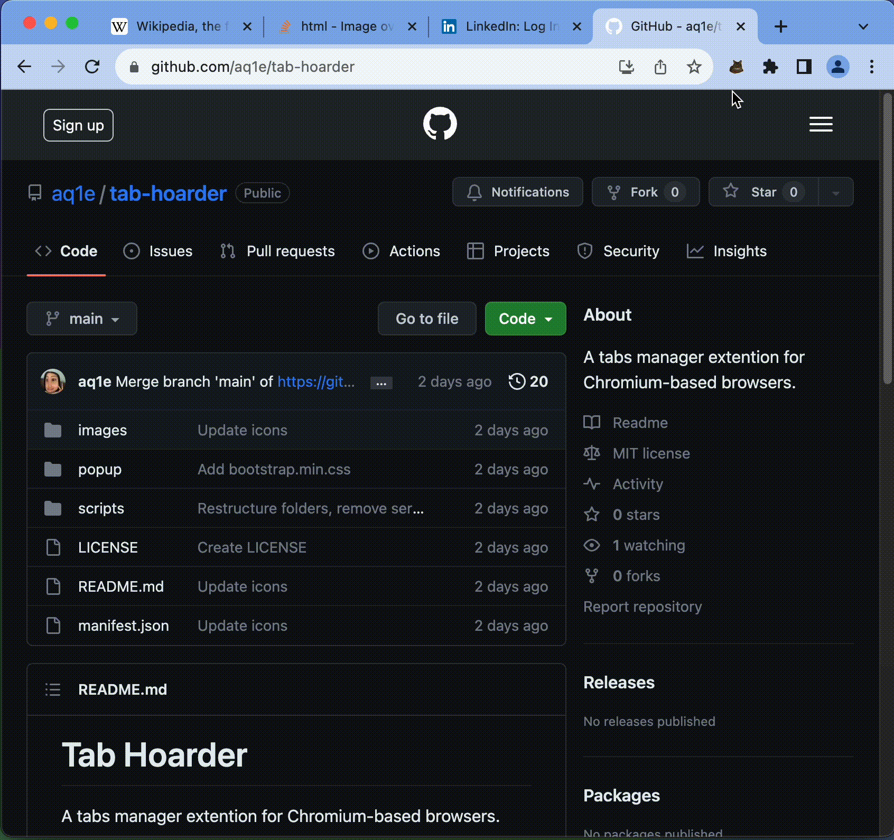

 
 <a href="https://chromewebstore.google.com/detail/tabby-hoarder/nioldpiplkfjcdokagnkdljlbckinndn">
  <h1><strong>Tabby Hoarder</strong></h1>
 </a>

A tabs manager extension for Chromium-based browsers.

## Features

- **Store Away Tabs**: Create a bookmarks folder and store all tabs in the currently active window
  

    
  

- **Restore Tabs**: Open up a group of tabs in a new window
  

    
  

## Useful if you...

- often have 100 tabs open because you are not ready to lose all of them, but need to move on to a new task.
- have a set of websites that you always need, and would like to open them together quickly.

## Installation

- install it from [Chrome web store](https://chromewebstore.google.com/detail/tabby-hoarder/nioldpiplkfjcdokagnkdljlbckinndn)

   
  Or...
   

- Clone the repository
- Go to <chrome://extensions>
- Click **Load Unpacked** and select the cloned repository

## Permissions

- **tabs**: To read information about your open tabs.
- **bookmarks**: To read, add to, and delete your bookmarks. This extension works by reading / creating / deleting folders under your **Other Bookmarks** folder that Chromium-based browsers have by default.
- **tabGroups**: To restore and group a group of tabs.

## Acknowledgments

The button icons used in this extension were generated with [Magician](https://magician.design/), a program created by Diagram.
